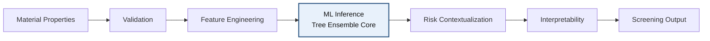

# Dravix — Materials Fire-Risk Screening Engine

Early-stage machine-learning screening system for prioritizing candidate materials before physical fire testing.


## System Overview

Formal fire testing is expensive, sample-intensive, and operationally slow. Programs often need to make material down-selection decisions before standardized burn testing, cone calorimetry, or broader qualification workflows can be scheduled. That creates a gap between early design choices and the evidence required for high-confidence validation.

Dravix is designed to operate in that gap. It provides a deterministic, descriptor-driven screening signal so engineering teams can compare candidate materials before committing to physical test campaigns. The goal is not to replace laboratory evidence, but to improve prioritization discipline when time, budget, and sample availability are limited.

The system introduces predictive insight upstream of testing by converting structured material properties into a relative fire-risk screening output. This makes early-stage triage more consistent, exposes the major drivers behind a given prediction, and helps focus scarce test capacity on the most informative candidates.

## Live System

API Documentation  
https://mfr-material-risk-engine.onrender.com/docs

Interactive Demo  
https://dravix-engine.materiamse.com

Repository  
https://github.com/nikhilesh-s/mfr-material-risk-engine

## System Architecture



The inference block is the system core. Upstream stages standardize and validate inputs; downstream stages contextualize the model output, attach explanation artifacts, and return a screening-oriented result suitable for engineering review.

## Model

Dravix uses a tree-based ensemble model in the RandomForest-style family. The current backend model is trained on approximately 1,771 materials and consumes 15 engineered input features derived from structured material descriptors.

The model output is a relative fire-risk screening signal. It is intended for ranking and comparison rather than direct certification or absolute safety claims.

Tree-based ensembles were selected for three reasons:

- interpretability through feature-level contribution analysis
- nonlinear modeling capacity across heterogeneous material properties
- robustness when training data is meaningful but still moderate in size

## Interpretability

Dravix exposes model reasoning as part of the inference response rather than treating the predictor as a black box. Interpretability is provided through `treeinterpreter`-based feature contributions, with the most influential drivers surfaced for review.

The current API emphasizes:

- per-feature contribution values
- top 3 drivers for a prediction
- variance-based confidence indicators derived from ensemble behavior

This makes the output easier to audit during candidate review and helps distinguish strong relative signals from lower-confidence cases.

## Data

Current training data summary:

- approximately 1,771 materials
- polymers
- composites
- generic materials

Primary model dataset path:

`data/phase3_model/materials_phase3_with_target_v2.csv`

The training corpus is intended to support comparative screening across mixed material classes rather than standards-based qualification.

## System Boundaries

Dravix is a screening tool only.

Dravix does not:

- replace fire testing
- certify materials
- simulate fire behavior
- make regulatory decisions
- perform ASTM qualification
- perform autonomous retraining

Any high-consequence material decision should still be validated through physical testing and formal engineering review.

## Repository Structure

```text
.
├── api/                     FastAPI application and HTTP entrypoints
├── src/                     Core inference, feature handling, and model utilities
├── data/                    Raw, processed, and model-ready datasets
├── docs/                    Architecture, API, validation, and release documentation
├── models/                  Frozen model artifacts used by the API
├── tests/                   Regression and validation-oriented tests
├── frontend/                Demo UI source for the live interface
└── mfr-risk-model/notebooks/ Historical exploratory notebooks and analysis work
```

Directory roles:

- `api/`: request handling, API metadata, and response serialization
- `src/`: deterministic inference pipeline, model loading, lookup utilities, and supporting logic
- `data/`: source and transformed datasets, including the current Phase 3 model dataset
- `docs/`: system overview, architecture, API specification, boundaries, and release notes
- `mfr-risk-model/notebooks/`: retained notebook workspace for historical analysis; no root `notebooks/` directory is currently checked in on `main`

## Running Locally

Dravix currently runs as a FastAPI service from the repository root.

```bash
git clone https://github.com/nikhilesh-s/mfr-material-risk-engine.git
cd mfr-material-risk-engine

python3.11 -m venv .venv
source .venv/bin/activate
pip install -r requirements.txt

uvicorn api.main:app --reload
```

The local API will then be available at `http://127.0.0.1:8000`, with interactive docs at `http://127.0.0.1:8000/docs`.

## Backend Validation

Run the platform endpoint harness against the deployed service:

```bash
python scripts/test_platform_endpoints.py
```

Override the target base URL if needed:

```bash
DRAVIX_BASE_URL=http://127.0.0.1:8000 python scripts/test_platform_endpoints.py
```

## UI Design Ingestion System

Dravix stores UI snapshots in dated ingestion folders under `design_ingestion/` so design packages can be versioned, reviewed, and reused without disrupting backend development or deployment stability.

Each ingestion snapshot preserves raw source files, reusable stripped components, and design tokens before any frontend integration work begins.

## Roadmap

- Phase 2 - Engineering Prototype (current release baseline)
- Phase 3 - Pilot validation
- Phase 4 - Workflow integration
- Phase 5 - Multi-property materials screening

## Team

- Nikhilesh Suravarjjala - Engineering Lead + CEO
- Jaanya Gupta - Business Lead + CFO
- Arnav Saini - Data Engineer

## License

A formal open-source license has not yet been published in this repository. Until a license file is added, treat the codebase and associated artifacts as all rights reserved by default.
