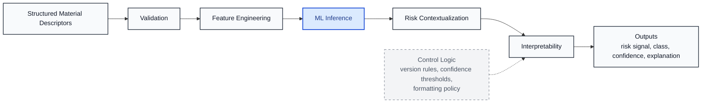
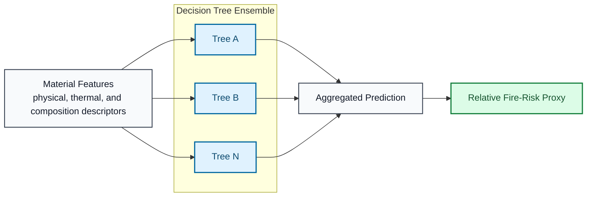
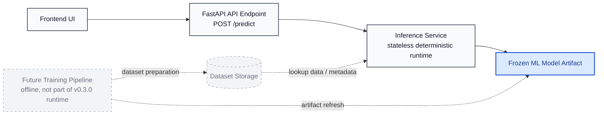

# Dravix v0.3.0 Architecture Diagrams

## Overview

This document provides engineering diagrams for the Dravix v0.3.0 release.

Dravix is a deterministic decision-support system for early-stage material fire-risk screening. The runtime accepts structured material descriptors, processes them through a fixed inference pipeline, and returns a relative screening signal together with interpretability outputs.

The diagrams in this document describe the deployed inference path only. They intentionally exclude certification logic, real-time sensing, automated retraining, and regulatory decision behavior because those functions are outside the scope of Dravix v0.3.0.

Mermaid source files are also stored in `docs/diagrams/`:
- [`docs/diagrams/dravix-system-flow.mmd`](/Users/niks/Documents/GitHub/mfr-material-risk-engine/docs/diagrams/dravix-system-flow.mmd)
- [`docs/diagrams/dravix-inference-pipeline.mmd`](/Users/niks/Documents/GitHub/mfr-material-risk-engine/docs/diagrams/dravix-inference-pipeline.mmd)
- [`docs/diagrams/dravix-ml-core.mmd`](/Users/niks/Documents/GitHub/mfr-material-risk-engine/docs/diagrams/dravix-ml-core.mmd)
- [`docs/diagrams/dravix-deployment.mmd`](/Users/niks/Documents/GitHub/mfr-material-risk-engine/docs/diagrams/dravix-deployment.mmd)

## System Flow Diagram

This diagram shows the release-level system flow from structured input through output generation. The main prediction path is linear and deterministic. Control logic is shown with dashed arrows and is limited to interpretation behavior, formatting policy, or confidence presentation. It does not alter the prediction path itself.

Relation to deterministic inference:
- Validation, feature engineering, and model inference define the prediction path.
- Risk contextualization and interpretability package the prediction for engineering review.
- Dashed control logic influences explanation policy only.

## Inference Pipeline

This diagram expands the deterministic inference path into discrete execution stages. It should be read left to right as the request moves from ingestion to response generation. Model inference is highlighted because it is the central computation step around which preprocessing and post-processing are organized.

```mermaid
flowchart LR
    ING[1. Input Ingestion] --> SCH[2. Schema Validation]
    SCH --> NORM[3. Feature Normalization]
    NORM --> ENG[4. Feature Engineering]
    ENG --> INF[5. Model Inference]
    INF --> RISK[6. Risk Contextualization]
    RISK --> INT[7. Interpretability Generation]
    INT --> OUT[8. Output Generation]

    classDef standard fill:#f8fafc,stroke:#374151,color:#111827,stroke-width:1.5px;
    classDef central fill:#dbeafe,stroke:#1d4ed8,color:#1e3a8a,stroke-width:3px;

    class ING,SCH,NORM,ENG,RISK,INT,OUT standard;
    class INF central;
```

Relation to deterministic inference:
- Input structure is fixed before inference begins.
- Normalization and feature engineering are repeatable and release-frozen.
- The same feature vector entering the same model artifact yields the same inference result.
- Output generation adds packaging, not runtime learning.

## ML Core Diagram

This diagram isolates the machine learning core. The model accepts material descriptors, routes them through a decision-tree ensemble, aggregates the tree outputs, and produces a relative fire-risk proxy suitable for screening.

Relation to deterministic inference:
- The ensemble is fixed at deployment time.
- Aggregation is deterministic for a given feature vector.
- The output is a relative fire-risk proxy, not a certified physical measure.

## Deployment Architecture

This diagram shows the deployed serving path. The frontend calls a FastAPI endpoint, which passes the request into a stateless inference service backed by a frozen model artifact. Optional storage and future training components are shown in gray because they are not part of the active v0.3.0 runtime path.

Relation to deterministic inference:
- The serving path is synchronous and stateless.
- The model artifact is loaded and used for inference only.
- Future training remains offline and outside the release runtime.

## Design Philosophy

The diagrams reflect the core design principles of Dravix v0.3.0.

### Deterministic Inference

The production path is inference only. For the same input and the same deployed artifact, the system is intended to produce the same result.

### Interpretability-First Design

Interpretability is part of the runtime design, not a separate analysis mode. The system is built to return explanations together with the screening output.

### Screening Not Certification

The diagrams model a ranking and prioritization engine. They do not represent a certification workflow, a standards-compliance engine, or a fire simulation stack.

### Explicit Uncertainty Signaling

Confidence and interpretation logic are part of the documented output behavior. Uncertainty is surfaced so engineers can evaluate how much weight to place on a given screening result.
