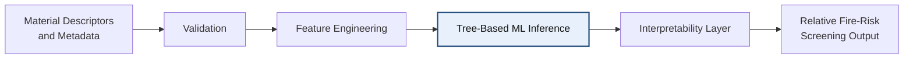

# Dravix: Early-Stage Materials Fire-Risk Screening via Interpretable Machine Learning

## Abstract

Fire-resistance evaluation is typically concentrated late in the engineering workflow, when candidate materials have already been narrowed and physical testing becomes unavoidable. This creates a practical bottleneck: laboratory fire testing is expensive, slow, and sample-intensive, while early design decisions still require some basis for prioritizing which materials merit deeper investigation. In many settings, the result is a trial-and-error process in which potentially promising materials are either tested too late or excluded too early due to limited predictive guidance.

Dravix v0.3.0 is a deterministic machine-learning-based decision-support system intended to address that early-stage gap. The system converts structured material descriptors into a relative fire-risk screening signal using a frozen tree-based ensemble model and a release-defined inference pipeline. Rather than attempting to certify materials or simulate combustion physics, Dravix is designed to support comparative ranking and triage before formal fire testing. The system also exposes local feature contributions and confidence indicators so that model outputs can be reviewed in an engineering context. The resulting workflow is intended to provide earlier fire-risk insight while preserving the central role of physical testing in qualification and regulatory decision-making.

## 1. Introduction

Fire resistance is usually established through physical testing, standards-based evaluation, and engineering review. Those processes are necessary, but they are also resource-constrained. Sample preparation, test scheduling, instrumentation, and interpretation all introduce cost and delay, especially when teams need to compare multiple candidate materials under limited program timelines.

At the early design stage, engineers often lack actionable fire-risk insight. Material selection may still be in flux, relevant descriptors may be incomplete, and test-ready specimens may not yet exist. As a result, down-selection can depend on partial heuristics, fragmented prior experience, or conservative elimination of unfamiliar candidates.

This lack of early-stage visibility limits exploration. Materials that may ultimately perform well can be excluded before evidence is gathered, while less suitable candidates may continue through the workflow simply because they are better known or easier to justify. The consequence is an inefficient screening process that delays learning until relatively late in the program.

Dravix is designed as a screening tool for this earlier decision point. It accepts structured material descriptors, applies deterministic preprocessing and inference, and returns a relative fire-risk screening signal intended for comparison and prioritization. The system is explicitly bounded: it informs material triage before physical testing, but it does not replace the test process itself.

## 2. System Design

Dravix is organized as a deterministic inference pipeline with clearly separated input handling, feature construction, model execution, interpretation, and output formatting stages.

The input layer accepts structured material descriptors and associated metadata. These inputs are validated for schema consistency, required fields, and basic format correctness before they are transformed into the fixed feature representation expected by the model. Feature engineering is release-frozen for v0.3.0 so that identical inputs are mapped consistently within the same build.

The core inference stage applies a tree-based ensemble model to the engineered feature vector. A downstream interpretability layer computes local contribution signals and summarizes the most influential drivers for the prediction. The final output is a relative fire-risk screening signal accompanied by supporting context for engineering review.

In this architecture, the model is the computational core, but the surrounding stages are necessary to keep the system stable, interpretable, and suitable for controlled engineering use.

## 3. Machine Learning Model

The v0.3.0 release uses a tree-based ensemble model in the RandomForest-style family. The current backend model is trained on approximately 1,771 materials and operates on a 15-feature engineered representation used for release-defined screening inference.

Tree-based models were selected for three practical reasons. First, they support interpretable local reasoning through feature contribution methods that are compatible with engineering review. Second, they can represent nonlinear relationships and threshold effects that are common in heterogeneous materials data. Third, they tend to be robust when datasets are meaningful but still moderate in size, which is often the case in applied engineering settings where fully standardized, high-volume training data is not available.

The model output should be read as a relative screening signal. It is designed to help rank or prioritize candidate materials, not to provide a direct physical measurement of fire behavior or a certification-grade prediction.

## 4. Interpretability and Uncertainty

Dravix is designed to expose model reasoning rather than return an unexplained score. For each prediction, the system computes local feature contribution values using `treeinterpreter`, allowing reviewers to inspect which descriptors pushed the screening result upward or downward.

The API additionally surfaces the top 3 feature drivers for each prediction. This provides a compact view of the dominant local influences without requiring users to parse the full contribution vector before deciding whether a result appears plausible or warrants escalation.

Uncertainty is represented through variance-based confidence indicators derived from ensemble behavior. These indicators are not a safety guarantee, but they help distinguish cases where the model appears to be operating in a more familiar region of feature space from cases where the output may warrant more caution.

The design philosophy is explicit: uncertainty should be surfaced rather than hidden. Since Dravix is intended for early-stage screening, suppressing uncertainty would create a misleading sense of precision and encourage misuse of a comparative signal as if it were a conclusive test result.

## 5. Validation Behavior

Current validation evidence is best interpreted as behavioral alignment rather than proof of certification-level predictive accuracy. In screening-oriented analyses, the Dravix signal has shown trends that are directionally consistent with known ignition-related indicators.

In particular, the screening output has shown positive correlation with external heat flux and negative correlation with time to ignition. Those relationships are consistent with the expectation that higher thermal exposure tends to increase concern, while longer time-to-ignition tends to indicate greater relative resistance under comparable conditions.

Legacy proxy-score validation artifacts in the repository report approximate correlations of `+0.86` with external heat flux and `-0.58` with time to ignition. These results should be read as directional validation cues rather than universal laws of material behavior.

Accordingly, the Dravix screening signal should be interpreted as a relative trend indicator. It is not a direct physical measurement, and it does not substitute for laboratory evidence when high-consequence decisions are being made.

## 6. System Boundaries

Dravix provides early-stage screening only.

The system does not:

- replace fire testing
- certify materials
- simulate fire behavior
- make regulatory decisions

These boundaries are central to correct deployment. Dravix is intended to support prioritization and triage before physical testing, not to replace standards-based validation or formal engineering judgment.

## 7. Deployment

The deployed system is structured as a stateless FastAPI inference service. A frozen model artifact is loaded at startup, and requests are served through a synchronous API endpoint that applies validation, feature engineering, inference, and interpretation within a single request lifecycle.

This backend is paired with a frontend interface that exposes the screening workflow to users and with live API documentation for direct inspection and programmatic integration. The deployment approach is intentionally simple: model serving is centralized, inference is deterministic within a build, and no online retraining is performed in production.

This stateless deployment model reduces operational complexity and keeps the system aligned with its intended role as an engineering screening service rather than a continuously adaptive decision engine.

## 8. Future Work

Several next steps follow naturally from the current release.

The first is dataset expansion, both to improve material coverage and to reduce sensitivity to gaps in class representation. The second is pilot validation with external users so that screening behavior can be assessed against real engineering workflows rather than repository-only analyses.

Additional work is also needed on interpretability tooling, particularly around clearer explanation views, reviewer workflows, and confidence communication. Beyond fire-risk screening alone, a longer-term direction is expansion toward multi-property materials screening in which fire-related concerns are evaluated alongside other engineering constraints.
